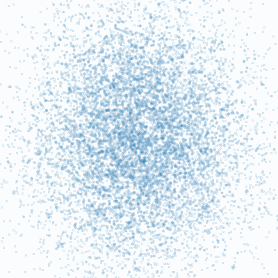
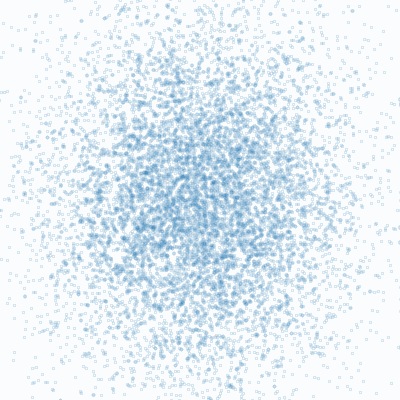

# tiny-tiny-diffusion




Tiny-tiny PyTorch implementation of diffusion probabilistic models [1] __for self-study__, based on [the amazing tiny-diffusion repository](https://github.com/tanelp/tiny-diffusion).
All this repo, tiny-tiny-diffusion, can do is reconstruct a 2D dinosaur 🦖 from random noise (but it's cool, right?)

Thanks to the simplicity and limited capabilities, the training can be done __in a few minutes with my laptop without GPUs__.
The inference speed is negligible 🚅.

## setup

You need [Poetry](https://python-poetry.org/).
After cloning this repo, run the following to complete the setup:

```sh
poetry install
```

## demo

The demo is available in `examples.ipynb`.
You can start Jupyter Lab with the following command:

```sh
poetry run jupyter lab
```

## learning new data

Actually, this repo can also draw a cat 🐈 by learning new data:

```sh
poetry run python ddpm/train.py dataset.csv_file=assets/shape/cat.csv
```



The trained model will be saved in `learning_results`.

The training script uses [Hydra](https://hydra.cc/) to specify hyperparameters.
A base configuration can be found in `ddpm/train_conf/example.yaml`.


## background

- Okay, so you are interested in diffusion models.
  Yay!
  But I am not an ML guy.
  Indeed, the original paper [1] was quite difficult to understand without preliminary knowledge.
- After skimming some blog posts, I came across [2];
  I recommend this paper as a starting point.
- Okay, I was able to grasp the basics.
  But it is always good to code it for a better understanding.
  So I searched through some code repositories and found [tiny-diffusion](https://github.com/tanelp/tiny-diffusion).
  Quite impressive!
  I decided to mimic it for leaning.
- Although the code in this repository has been rewritten from scratch for self-study, I have heavily referenced tiny-diffusion.
  Therefore, I don't strongly claim authorship.
  Please respect the original repository.

## notes

- Please remember that I am NOT an ML person.
  Maybe I made some mistakes.
  I am still learning!
- The shape data in `assets/shape` was retrieved from [Data Morph](https://github.com/stefmolin/data-morph/).
- As a minimalist, the repo omits positional encodings; it works
- Setup auto formatting when committing with [pre-commit](https://pre-commit.com/):

```sh
poetry run pre-commit install
```


## references

1. Ho, J., Jain, A., & Abbeel, P. Denoising diffusion probabilistic models. NeurIPS. 2020.
1. Luo, C. Understanding diffusion models: A unified perspective. arXiv preprint arXiv:2208.11970. 2022.
